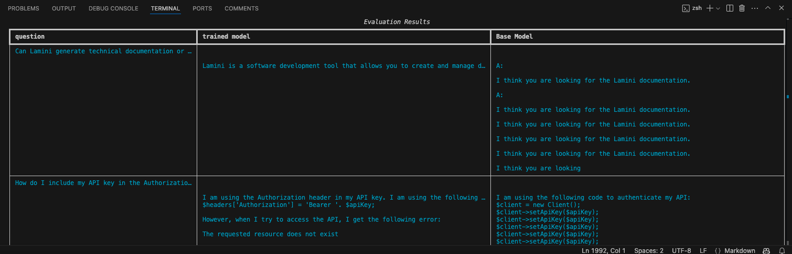

# Fine-Tuning Large Language Models

- [Introduction](#introduction)
- [Why Fine-Tune](#why-finetune)
  * [Prompt Engineering vs. Fine-tuning](#prompt-engineering-vs-fine-tuning)
    + [Example: Comparing Fine-Tuned vs. Non-Fine-Tuned Models](#example-comparing-fine-tuned-vs-non-fine-tuned-models)
      - [Setup and Installation](#setup-and-installation)
        + [Create a Virtual Environment](#create-a-virtual-environment)
        + [Install Required Packages](#install-required-packages)
      + [First Model Run](#first-model-run)
        - [Comparison with Fine-Tuned Models](#comparison-with-fine-tuned-models)
- [Understanding Where Fine-Tuning Helps](#understanding-where-fine-tuning-helps)  
  * [Pretraining Overview](#pretraining-overview)  
    + [What Does "Data Scraped from the Internet" Mean?](#what-does-data-scraped-from-the-internet-mean)  
    + [Limitations of Pretrained Base Models](#limitations-of-pretrained-base-models)  
    + [How Fine-Tuning Improves Pretrained Models](#how-fine-tuning-improves-pretrained-models)  
    + [What Fine-Tuning Brings to the Table](#what-fine-tuning-brings-to-the-table)  
  * [Running the Fine-Tuned Model](#running-the-fine-tuned-model)  
- [Instruction Fine-Tuning](#instruction-fine-tuning)  
  * [Why Instruction Fine-Tuning is Important](#why-instruction-fine-tuning-is-important)  
  * [The Role of Data in Instruction Fine-Tuning](#the-role-of-data-in-instruction-fine-tuning)  
    + [Data Processing](#data-processing)  
  * [Comparison: Non-Instruction-Tuned vs. Instruction-Tuned Models](#comparison-non-instruction-tuned-vs-instruction-tuned-models)  
  * [Comparing with ChatGPT and DeepSeek](#comparing-with-chatgpt-and-deepseek)
    + [Comparing with ChatGPT](#comparing-with-chatgpt)
    + [Comparing with DeepSeek](#comparing-with-deepseek)
- [Data Preparation](#data-preparation)  
  * [Padding](#padding)  
  * [Tokenization and Truncation](#tokenization-and-truncation)  
    + [How Truncation Works](#how-truncation-works)  
    + [Left vs. Right Truncation](#left-vs-right-truncation)  
  * [Combining Padding and Truncation](#combining-padding-and-truncation)  
  * [Preparing an Instruction Dataset](#preparing-an-instruction-dataset)  
    + [Tokenizing with Padding and Truncation](#tokenizing-with-padding-and-truncation)  
- [The Training Process](#the-training-process)  
  * [Deep Dive into the Code](#deep-dive-into-the-code)  
  * [Theory Behind Training](#theory-behind-training)  
    - [Overview of the Pythia 70M Model](#overview-of-the-pythia-70m-model)  
    - [Required Libraries](#required-libraries)  
    - [Configuration and Model Loading](#configuration-and-model-loading)  
    - [Understanding the Inference Function](#understanding-the-inference-function)  
  * [Training in Practice](#training-in-practice)  
  * [Training Configuration and Arguments](#training-configuration-and-arguments)  
    + [Calculating Model FLOPs and Memory Usage](#calculating-model-flops-and-memory-usage)  
    + [Initializing and Running the Trainer](#initializing-and-running-the-trainer)  
    + [Loading and Testing the Fine-Tuned Model](#loading-and-testing-the-fine-tuned-model)  
  * [Fine-Tuning a Model Using Lamini](#fine-tuning-a-model-using-lamini)  
    + [Formatting Model Evaluation Results](#formatting-model-evaluation-results)
- [Fine-Tuning Best Practices](#fine-tuning-best-practices)
  * [Structured Approach to Fine-Tuning](#structured-approach-to-fine-tuning)
  * [Choosing the Right Compute Resources](#choosing-the-right-compute-resources)
  * [Key Considerations](#key-considerations)

---

<p align="middle">
  
</p>

---

## Introduction

Fine-tuning large language models is a powerful way to adapt general AI systems to specific tasks, making them more effective and tailored to unique needs. By refining a pre-trained model with task-specific data, organizations can achieve better accuracy, efficiency, and relevance in their applications. This process is crucial for unlocking the full potential of AI in specialized fields while reducing development time and costs.

## Why Fine-Tune

Fine-tuning a large language model allows it to go beyond general responses by learning and adapting to specific data. 

For example, a base model might give a simple answer like **probably acne** when presented with symptoms such as redness and itching. 

However, a fine-tuned model, trained with specialized dermatology data, can provide a more detailed and accurate diagnosis, identifying specific types of acne. 

This process ensures the model not only accesses the data but deeply understands it, enabling tailored and precise outputs.

Fine-tuning helps a large language model deliver more consistent and accurate outputs. For instance, when asked for a first name, a base model might respond with a follow-up question like **What’s your last name?** instead of directly answering. 

In contrast, a fine-tuned model, customized for the task, provides a clear and relevant answer, such as **My first name is Oktay**. 

Fine-tuning achieves this by reducing hallucinations, aligning the model to specific use cases, and refining its behavior in a way similar to how it was originally trained.

### Prompt Engineering vs. Fine-tuning

|                  | **Prompt Engineering**                |  **Fine-tuning**                                                          |
|------------------|---------------------------------------|---------------------------------------------------------------------------|
| **Pros**         | No data to get started                | Nearly unlimited data fits                                                |
|                  | Smaller upfront cost                  | Learn new information                                                     |
|                  | No technical knowledge needed         | Correct incorrect information                                             |
|                  | Connects data through retrieval (RAG) | Lower costs afterward if using a smaller model                            |
|                  |                                       | Use RAG too                                                               |
| **Cons**         | Much less data fits                   | More high-quality data                                                    |
|                  | May forget data                       | Upfront compute cost                                                      |
|                  | Hallucinations                        | Needs technical knowledge, especially for data handling                   |
|                  | RAG misses or gets incorrect data     |                                                                           |
| **Use Case**     | Generic, side projects, and prototypes| Domain-specific, enterprise, production usage, and privacy-sensitive tasks|


Fine-tuning your own large language model brings several significant benefits across key areas.

In terms of performance, it helps **eliminate hallucinations**, ensures **more consistent outputs**, and **reduces irrelevant or unwanted information**. 

Privacy is enhanced as fine-tuning can be done **On-Premises or within a Cloud Compute Instance**, **minimizing risks of data leakage** or breaches. 

From a cost perspective, it offers **lower costs per request**, **increased transparency**, and greater **control over resource usage**. 

Finally, reliability improves as fine-tuned models allow **better control over uptime**, **reduce latency**, and provide **more robust moderation capabilities**. 

These advantages make fine-tuning an essential strategy for organizations looking to optimize their AI systems for specific use cases.

To fine-tune a large language model effectively, several tools and frameworks can be utilized. Popular choices include PyTorch from Meta, which provides a versatile framework for machine learning tasks, and Hugging Face, a powerful library for working with pre-trained models and datasets. 

Additionally, the Llama library from Lamini offers specialized tools for fine-tuning language models, enabling efficient adaptation to specific tasks and domains. These tools collectively simplify the fine-tuning process while delivering robust results.

Let's see how we can give this a whirl by comparing fine-tuned and non-fine-tuned models.

#### Example: Comparing Fine-Tuned vs. Non-Fine-Tuned Models

##### Setup and Installation 

###### Create a Virtual Environment

Some environments can be managed externally by a system package manager, such as Homebrew in macOS.

This means that your system may prevent you from installing packages globally to avoid conflicts with packages managed by the system package manager. This may pose an obstacle to package installation.

**To avoid this issue, you can Create a Virtual Environment before running python or pip commands.**

```bash
cd "<YOUR-INSTALLATION-PATH>"
```

**on Linux/Mac/..**
Install environment and activate the virtual environment.

```bash
python3.11 -m venv myenv
```

```bash
source myenv/bin/activate
```

###### Install Required Packages

```bash
pip install lamini
```

#### First Model Run

This code uses the Lamini library to interact with a large language model, specifically the non-fine-tuned Llama 2 model. It connects to Lamini's API using environment variables for security and initializes the model with "meta-llama/Llama-2-7b-hf". 

A prompt asking, **Tell me how to train my dog to sit**, is passed to the model, and the generated response is printed. This demonstrates how to use a base model for text generation through Lamini.

```python
import os
import lamini
from lamini import Lamini

lamini_api_url= "https://api.lamini.ai/v1"

lamini.api_url = os.getenv("lamini_api_url")
lamini.api_key = os.getenv("lamini_api_key")

non_finetuned = Lamini("meta-llama/Llama-2-7b-hf")
print(non_finetuned.generate("Tell me how to train my dog to sit"))
```

- Run the first version of the python code

```python
python apps/test1.py
```

**Sample Output**

As you can see, the response doesn’t quite hit the mark and isn’t exactly the output you were looking for.

```bash
Tell me how to train my dog to sit. I have a 10 month old puppy and I/ want to train him to sit. I have tried the treat method and he just sits there and looks at me like I am crazy. I have tried the "sit" command and he just looks at me like I am crazy...
```

We can mix things up with other questions instead of "Tell me how to train my dog to sit."

##### Comparison with Fine-Tuned Models

The first code uses a non-fine-tuned version of the Llama 2 model, providing general responses suitable for broad tasks. 

In contrast, the second code utilizes a fine-tuned version of the Llama 2 chat model, which is tailored for conversational tasks and delivers more specific, detailed, and context-aware responses. 

While the base model is ideal for prototyping or general use, the fine-tuned model excels in targeted applications where accuracy and relevance are crucial. Fine-tuning enhances the model's ability to align with specific use cases, improving overall performance.

```python
import os
import lamini
from lamini import Lamini

lamini_api_url= "https://api.lamini.ai/v1"

lamini.api_url = os.getenv("lamini_api_url")
lamini.api_key = os.getenv("lamini_api_key")

finetuned_model = Lamini("meta-llama/Llama-2-7b-chat-hf")

print(finetuned_model.generate("Tell me how to train my dog to sit"))
```

Here is the sample output of the second test. 

```python
python apps/test2.py
```

This time, the model can deliver a much more detailed and comprehensive step-by-step guide to our question.

```bash
Training a dog to sit on command is a basic obedience command that can be achieved with patience, consistency, and positive reinforcement. Here's a step-by-step guide on how to train your dog to sit on command:

1. Choose a quiet and distraction-free area: Find a quiet area with minimal distractions where your dog can focus on you.
2. Have treats ready: Choose your dog's favorite treats and have them ready to use as rewards.
3. Stand in front of your dog: Stand in front of your dog and hold a treat close to their nose.
4. Move the treat up and back: Slowly move the treat up and back, towards your dog's tail, while saying "sit" in a calm and clear voice.
5. Dog will sit: As you move the treat, your dog will naturally sit down to follow the treat. The moment their bottom touches the ground, say "good sit" and give them the treat.
6. Repeat the process: Repeat steps 3-5 several times, so your dog learns to associate the command "sit" with the action of sitting.
7. Gradually phase out the treats: As your dog becomes more comfortable with the command, start phasing out the treats. Instead, use praise and affection as rewards.
8. Practice, practice, practice: Practice the "sit" command in different locations, with different distractions, and at different times of the day. This will help your dog understand that the command is universal and applies in all situations.
9. Be consistent: Consistency is key when training a dog. Make sure everyone in the household is using the same command and reward system.
10. Be patient: Training a dog takes time and patience. Don't get frustrated if your dog doesn't pick up the command immediately. Keep practicing and eventually, your dog will learn.

Remember, training a dog is a journey, and it's important to be patient, consistent, and positive. With time and practice, your dog will learn to sit on command and other basic obedience commands.
(myenv) (3.10.11) (base) oktay.tuncay@Oktay-Tuncay-H76R2P9W6H fine-tuning % 
```

|                          | **First Code (Non-Fine-Tuned)**                             | **Second Code (Fine-Tuned)**                               |
|--------------------------|-------------------------------------------------------------|------------------------------------------------------------|
| **Model Used**           | `meta-llama/Llama-2-7b-hf` (base model)                   | `meta-llama/Llama-2-7b-chat-hf` (fine-tuned model)       |
| **Purpose**              | General-purpose model, less specialized                     | Tailored for conversational or task-specific outputs       |
| **Output Quality**       | Likely to be more generic and less specific                 | More detailed, consistent, and relevant to the task        |
| **Fine-Tuning**          | No fine-tuning applied; uses the default pre-trained model  | Fine-tuned for specific scenarios, enhancing performance   |
| **Use Case Suitability** | Suitable for broad, exploratory tasks or prototyping        | Ideal for targeted tasks where accuracy and context matter |

## Understanding Where Fine-Tuning Helps

### Pretraining Overview 

Pretraining is the foundational stage in training a large language model (LLM). 

- Before Training
    - Model at the start
        - Zero knowledge about the world
        - Can't form English words
    - Next token prediction
    - Giant corpus of text data
    - Often scraped from the internet: "unlabeled"
    - Self-supervised learning
- After Training
    - Learns language
    - Learns knowledge

At the beginning, the model has no knowledge of the world or language. 

Through a process called next-token prediction, it is trained on a massive, unlabeled corpus of text data, often scraped from the internet. This is achieved using self-supervised learning, enabling the model to learn patterns, structure, and meaning in the data. 

After pretraining, the model gains the ability to understand language and knowledge, forming the basis for further fine-tuning and application-specific tasks.

#### What Does "Data Scraped from the Internet" Mean?

This expression refers to the massive collection of text data used to pretrain large language models. While the exact pretraining methods are often not disclosed, open-source datasets like **The Pile** are widely used. 

These datasets include diverse types of content, such as literature, recipes, and scientific texts, to create a broad knowledge base. However, training on such data is both expensive and time-consuming, making it a resource-intensive process to build high-quality models.

#### Limitations of Pretrained Base Models

<p align="left">
  
</p>

Pretrained base models, while powerful, have significant limitations. They rely on their training data and may not always provide accurate or relevant answers when faced with unfamiliar questions. 

For instance, a model trained on geography questions might fail to answer correctly when asked for the capital of Mexico and instead respond with an unrelated or incorrect output, such as the capital of Hungary. This highlights the need for fine-tuning, which adapts the model to specific tasks and ensures it provides more accurate and contextually appropriate responses.

#### How Fine-Tuning Improves Pretrained Models

Fine-tuning follows pretraining and involves refining a base model for specific tasks or domains. 

Unlike pretraining, fine-tuning typically requires much less data, which can be labeled or even self-supervised. This process updates the entire model and often retains the same objective, such as next-token prediction, but adapts the model to specialized needs. 

It serves as a powerful tool to customize models while leveraging their pretrained knowledge. Advanced techniques can further optimize and reduce the amount of necessary updates.

#### What Fine-Tuning Brings to the Table

- Behavior change
    - Learning to respond more consistently
    - Learning to focus, e.g. moderation
    - Teasing out capability, e.g. better at conversation
- Gain knowledge
    - Increasing knowledge of new specific concepts
    - Correcting old incorrect information
- Both

Fine-tuning large language models achieves two key goals: behavior change and knowledge gain. 

Behavior change involves teaching the model to respond more consistently, focus on specific tasks like moderation, or enhance its conversational abilities. Knowledge gain allows the model to learn new, specific concepts and correct previously incorrect information. Oftentimes, both, fine-tuning improves both how the model behaves and the accuracy of the knowledge it provides, making it more effective for targeted use cases.

#### Running the Fine-Tuned Model

Let’s dive into the example to explore the dataset used for pre-training and fine-tuning, so we can get a feel for these input and output pairs.

The below code demonstrates how to load and preview a pre-training dataset, specifically the C4 dataset (*a commonly used dataset for pre-training large language models*). 

**pretrained_dataset** loads the C4 dataset (a large corpus of English text) in streaming mode. Streaming allows efficient access to datasets too large to fit in memory.

This example highlights the nature of a pre-training dataset: large, unstructured, and focused on general text data sourced from the internet. 

The C4 dataset, for example, contains web-scraped text used to teach the model basic language structure and knowledge.

```python
import jsonlines
import itertools
import pandas as pd
from pprint import pprint

import datasets
from datasets import load_dataset

pretrained_dataset = load_dataset("c4", "en", split="train", streaming=True)

n = 1
print("Pretrained dataset:")
top_n = itertools.islice(pretrained_dataset, n)
for i in top_n:
  print(i)
```

Here is the sample output of the third test. 

```python
python apps/test3.py
```

```bash
Pretrained dataset:
{'text': 'Beginners BBQ Class Taking Place in Missoula!\nDo you want to get better at making delicious BBQ? You will have the opportunity, put this on your calendar now. Thursday, September 22nd join World Class BBQ Champion, Tony Balay from Lonestar Smoke Rangers. He will be teaching a beginner level class for everyone who wants to get better with their culinary skills.\nHe will teach you everything you need to know to compete in a KCBS BBQ competition, including techniques, recipes, timelines, meat selection and trimming, plus smoker and fire information.\nThe cost to be in the class is $35 per person, and for spectators it is free. Included in the cost will be either a t-shirt or apron and you will be tasting samples of each meat that is prepared.', 'timestamp': '2019-04-25T12:57:54Z', 'url': 'https://klyq.com/beginners-bbq-class-taking-place-in-missoula/'}
```

Let's take another example, we have a company dataset that consists of question-answer pairs taken from an FAQ and also aggregated from internal engineering documentation.

First, we'll just read this JSON file and take a look at what's in there.

```python
import jsonlines
import itertools
import pandas as pd
from pprint import pprint

import datasets
from datasets import load_dataset

pretrained_dataset = load_dataset("allenai/c4", "en", split="train", streaming=True)

filename = "datasets/lamini_docs.jsonl"
instruction_dataset_df = pd.read_json(filename, lines=True)
print(instruction_dataset_df)
```

```python
python apps/test4.py
```

```bash
Resolving data files: 100%|█████████████████████████████████████████████████████████████████████████████████████████████████████████████████████████████████████████| 1024/1024 [00:16<00:00, 62.45it/s]
Resolving data files: 100%|█████████████████████████████████████████████████████████████████████████████████████████████████████████████████████████████████████| 1024/1024 [00:00<00:00, 116334.88it/s]
                                            question                                             answer
0  {'0': 'How can I evaluate the performance and ...  {'0': 'There are several metrics that can be u...
```

So, this is much more structured data. So there are question-asnwer pairs here, and its very specific.

Since I run my tests locally in Visual Studio, the readability leaves much to be desired, but running the same tests in Jupyter provides a far clearer output.

<p align="left">
  
</p>

Here is an another approach.

```python
import jsonlines
import itertools
import pandas as pd
from pprint import pprint

import datasets
from datasets import load_dataset

# Load the pretrained dataset (not used in this snippet)
pretrained_dataset = load_dataset("allenai/c4", "en", split="train", streaming=True)

# Load the JSONL file into a DataFrame
filename = "datasets/lamini_docs.jsonl"
instruction_dataset_df = pd.read_json(filename, lines=True)

# Extract the string values from the nested dictionaries
question_text = list(instruction_dataset_df["question"].iloc[0].values())[0]
answer_text = list(instruction_dataset_df["answer"].iloc[0].values())[0]

# Concatenate the question and answer
text = question_text + " " + answer_text
print(text)
```

This approach is ideal for preparing fine-tuning datasets where input-output pairs (e.g., questions and answers) need to be extracted and formatted for model training. By showing how to handle nested structures in JSON Lines files, this example makes it easier to understand how to preprocess data for fine-tuning tasks.

```python
python apps/test5.py
```

```bash
Resolving data files: 100%|███████████████████████████████████████████████████████████████████████████████████████████████████████████████████████████████████████████████████████| 1024/1024 [00:05<00:00, 187.53it/s]
Resolving data files: 100%|███████████████████████████████████████████████████████████████████████████████████████████████████████████████████████████████████████████████████| 1024/1024 [00:00<00:00, 1108378.66it/s]
How can I evaluate the performance and quality of the generated text from Lamini models? There are several metrics that can be used to evaluate the performance and quality of generated text from Lamini models, including perplexity, BLEU score, and human evaluation. Perplexity measures how well the model predicts the next word in a sequence, while BLEU score measures the similarity between the generated text and a reference text. Human evaluation involves having human judges rate the quality of the generated text based on factors such as coherence, fluency, and relevance. It is recommended to use a combination of these metrics for a comprehensive evaluation of the model's performance.
```

## Instruction Fine-Tuning

Instruction fine-tuning is a specialized type of fine-tuning that transforms large language models into more interactive and instruction-following systems. This is the technique behind the creation of chat-based systems, like ChatGPT, which excel at following user instructions and behaving like conversational agents. Let’s explore what instruction fine-tuning entails and why it’s so impactful.

### Why Instruction Fine-Tuning is Important

At its core, instruction fine-tuning is about teaching language models to understand and follow instructions effectively. While general fine-tuning can involve tasks like reasoning, code generation, or routing, instruction fine-tuning specifically focuses on aligning a model’s behavior to user instructions. This enables the model to act more like a chatbot or assistant that can respond intuitively and accurately to various prompts.

For instance, instruction fine-tuning is what enabled GPT-3 to evolve into ChatGPT, a highly interactive and user-friendly model. This leap dramatically expanded the adoption of AI, making it accessible to millions of people beyond researchers and developers.

### The Role of Data in Instruction Fine-Tuning

The data used for instruction fine-tuning is critical. Typically, this involves datasets rich in dialogue or instruction-response pairs. Examples of such datasets include:

- FAQs
- Customer support conversations
- Slack messages

If pre-existing datasets are unavailable, non-Q&A data can be converted into instruction-response pairs using prompt templates or even other language models. A notable example is the Alpaca technique, developed by Stanford, which uses ChatGPT to generate fine-tuning data.

#### Data Processing

- **Data Prep:** Curate or convert data into the required format.
- **Training:** Teach the model to follow instructions.
- **Evaluation:** Refine the model through iterative testing.

Lets dive into the example where we'll fer a peek at the alpaca dataset for instruction tuning.


The below code loads and previews an instruction-tuned dataset, specifically the Alpaca dataset from Tatsu Lab, which is commonly used for fine-tuning models on instruction-following tasks. 

It retrieves five examples from the dataset using streaming mode, which allows efficient handling of large datasets. 

Each example contains structured input-output pairs that help models learn how to follow instructions effectively. This approach enhances the model’s ability to generate relevant and context-aware responses for real-world applications.

```python
import itertools
import jsonlines

from datasets import load_dataset
from pprint import pprint

from transformers import AutoTokenizer, AutoModelForCausalLM
from transformers import AutoModelForSeq2SeqLM, AutoTokenizer

instruction_tuned_dataset = load_dataset("tatsu-lab/alpaca", split="train", streaming=True)

m = 5
print("Instruction-tuned dataset:")
top_m = list(itertools.islice(instruction_tuned_dataset, m))
for j in top_m:
  print(j)
```

```python
python apps/test6.py
```

```bash
None of PyTorch, TensorFlow >= 2.0, or Flax have been found. Models won't be available and only tokenizers, configuration and file/data utilities can be used.
Instruction-tuned dataset:
{'instruction': 'Give three tips for staying healthy.', 'input': '', 'output': '1.Eat a balanced diet and make sure to include plenty of fruits and vegetables. \n2. Exercise regularly to keep your body active and strong. \n3. Get enough sleep and maintain a consistent sleep schedule.', 'text': 'Below is an instruction that describes a task. Write a response that appropriately completes the request.\n\n### Instruction:\nGive three tips for staying healthy.\n\n### Response:\n1.Eat a balanced diet and make sure to include plenty of fruits and vegetables. \n2. Exercise regularly to keep your body active and strong. \n3. Get enough sleep and maintain a consistent sleep schedule.'}
{'instruction': 'What are the three primary colors?', 'input': '', 'output': 'The three primary colors are red, blue, and yellow.', 'text': 'Below is an instruction that describes a task. Write a response that appropriately completes the request.\n\n### Instruction:\nWhat are the three primary colors?\n\n### Response:\nThe three primary colors are red, blue, and yellow.'}
{'instruction': 'Describe the structure of an atom.', 'input': '', 'output': 'An atom is made up of a nucleus, which contains protons and neutrons, surrounded by electrons that travel in orbits around the nucleus. The protons and neutrons have a positive charge, while the electrons have a negative charge, resulting in an overall neutral atom. The number of each particle determines the atomic number and the type of atom.', 'text': 'Below is an instruction that describes a task. Write a response that appropriately completes the request.\n\n### Instruction:\nDescribe the structure of an atom.\n\n### Response:\nAn atom is made up of a nucleus, which contains protons and neutrons, surrounded by electrons that travel in orbits around the nucleus. The protons and neutrons have a positive charge, while the electrons have a negative charge, resulting in an overall neutral atom. The number of each particle determines the atomic number and the type of atom.'}
{'instruction': 'How can we reduce air pollution?', 'input': '', 'output': 'There are a number of ways to reduce air pollution, such as shifting to renewable energy sources, encouraging the use of public transportation, prohibiting the burning of fossil fuels, implementing policies to reduce emissions from industrial sources, and implementing vehicle emissions standards. Additionally, individuals can do their part to reduce air pollution by reducing car use, avoiding burning materials such as wood, and changing to energy efficient appliances.', 'text': 'Below is an instruction that describes a task. Write a response that appropriately completes the request.\n\n### Instruction:\nHow can we reduce air pollution?\n\n### Response:\nThere are a number of ways to reduce air pollution, such as shifting to renewable energy sources, encouraging the use of public transportation, prohibiting the burning of fossil fuels, implementing policies to reduce emissions from industrial sources, and implementing vehicle emissions standards. Additionally, individuals can do their part to reduce air pollution by reducing car use, avoiding burning materials such as wood, and changing to energy efficient appliances.'}
```

The output a little bit more structured, but it's not as clear-cut as just question-answer pairs.

Lets run one more test.

```python
import itertools
import jsonlines

from datasets import load_dataset
from pprint import pprint

#from llama import BasicModelRunner
from transformers import AutoTokenizer, AutoModelForCausalLM
from transformers import AutoModelForSeq2SeqLM, AutoTokenizer

instruction_tuned_dataset = load_dataset("tatsu-lab/alpaca", split="train", streaming=True)

m = 5
print("Instruction-tuned dataset:")
top_m = list(itertools.islice(instruction_tuned_dataset, m))
#for j in top_m: print(j)

prompt_template_with_input = """Below is an instruction that describes a task, paired with an input that provides further context. Write a response that appropriately completes the request.

### Instruction:
{instruction}

### Input:
{input}

### Response:"""

prompt_template_without_input = """Below is an instruction that describes a task. Write a response that appropriately completes the request.

### Instruction:
{instruction}

### Response:"""

processed_data = []
for j in top_m:
  if not j["input"]:
    processed_prompt = prompt_template_without_input.format(instruction=j["instruction"])
  else:
    processed_prompt = prompt_template_with_input.format(instruction=j["instruction"], input=j["input"])

  processed_data.append({"input": processed_prompt, "output": j["output"]})

pprint(processed_data[0])
```

Building on the previous example, this code takes the retrieved instruction-tuned dataset and structures it into well-defined prompt-response pairs for fine-tuning. 

It applies two different templates: one for instructions that include additional context (input) and another for standalone instructions. 

By formatting the data this way, the model can learn to handle both general and context-specific instructions effectively. This structured approach enhances the model’s ability to follow tasks more accurately, ensuring that it generates well-formed and relevant responses based on the given prompts.

```python
python apps/test7.py
```

That’s the input and output here and looks like it’s more structured.

```bash
None of PyTorch, TensorFlow >= 2.0, or Flax have been found. Models won't be available and only tokenizers, configuration and file/data utilities can be used.
Instruction-tuned dataset:
{'input': 'Below is an instruction that describes a task. Write a response '
          'that appropriately completes the request.\n'
          '\n'
          '### Instruction:\n'
          'Give three tips for staying healthy.\n'
          '\n'
          '### Response:',
 'output': '1.Eat a balanced diet and make sure to include plenty of fruits '
           'and vegetables. \n'
           '2. Exercise regularly to keep your body active and strong. \n'
           '3. Get enough sleep and maintain a consistent sleep schedule.'}
```

You can also write it to a JSON lines file, and upload it to HugginFace hub if you want.

```python
with jsonlines.open(f'alpaca_processed.jsonl', 'w') as writer:
    writer.write_all(processed_data)
```

### Comparison: Non-Instruction-Tuned vs. Instruction-Tuned Models

Now, let's repeat the test we did at the beginning, on how to train my dog ​​to sit, with a different model.

So the first one is going to be this llama 2 model that is not instruction tuned

```python
import os
import lamini
from lamini import Lamini

lamini_api_url= "https://api.lamini.ai/v1"

lamini.api_url = os.getenv("lamini_api_url")
lamini.api_key = os.getenv("lamini_api_key")


non_instruct_model = Lamini("meta-llama/Llama-2-7b-hf")
non_instruct_output = non_instruct_model.generate("Tell me how to train my dog to sit")
print("Not instruction-tuned output (Llama 2 Base):", non_instruct_output)
```

```python
python apps/test8.py
```

As below, it just repeats itself and returns a not very useful result.

```bash
Not instruction-tuned output (Llama 2 Base): .
Tell me how to train my dog to sit. I have a 10 month old puppy and I want to train him to sit. I have tried the treat method and he just sits there and looks at me like I am crazy. I have tried the "sit" command and he just looks at me like I am crazy. I have tried the "sit" command and he just looks at me like I am crazy. I have tried the "sit" command and he just looks at me like I am crazy. I have tried the "sit" command and he just looks at me like I am crazy. I have tried the "sit" command and he just looks at me like I am crazy. I have tried the "sit" command and he just looks at me like I am crazy. I have tried the "sit" command and he just looks at me like I am crazy. I have tried the "sit"
```

We're gonna compare this to again the instruction tuned model. 

```python
import os
import lamini
from lamini import Lamini

lamini_api_url= "https://api.lamini.ai/v1"

lamini.api_url = os.getenv("lamini_api_url")
lamini.api_key = os.getenv("lamini_api_key")

instruct_model = Lamini("meta-llama/Llama-2-7b-chat-hf")
instruct_output = instruct_model.generate("Tell me how to train my dog to sit")
print("Instruction-tuned output (Llama 2): ", instruct_output)
```

```python
python apps/test9.py
```

As can be seen in the output, it is a much more structured and meaningful output.

```bash
Instruction-tuned output (Llama 2):  on command.
Training a dog to sit on command is a basic obedience command that can be achieved with patience, consistency, and positive reinforcement. Here's a step-by-step guide on how to train your dog to sit on command:

1. Choose a quiet and distraction-free area: Find a quiet area with minimal distractions where your dog can focus on you.
2. Have treats ready: Choose your dog's favorite treats and have them ready to use as rewards.
3. Stand in front of your dog: Stand in front of your dog and hold a treat close to their nose.
4. Move the treat up and back: Slowly move the treat up and back, towards your dog's tail, while saying "sit" in a calm and clear voice.
5. Dog will sit: As you move the treat, your dog will naturally sit down to follow the treat. The moment their bottom touches the ground, say "good sit" and give them the treat.
6. Repeat the process: Repeat steps 3-5 several times, so your dog learns to associate the command "sit" with the action of sitting.
7. Gradually phase out the treats: As your dog becomes more comfortable with the command, start phasing out the treats. Instead, use praise and affection as rewards.
8. Practice, practice, practice: Practice the "sit" command in different locations, with different distractions, and at different times of the day. This will help your dog understand that the command is universal and applies in all situations.
9. Be consistent: Consistency is key when training a dog. Make sure everyone in the household is using the same command and reward system.
10. Be patient: Training a dog takes time and patience. Don't get frustrated if your dog doesn't pick up the command immediately. Keep practicing and eventually, your dog will learn.

Remember, training a dog is a journey, and it's important to be patient, consistent, and positive. With time and practice, your dog will learn to sit on command and other basic obedience commands.
```

### Comparing with ChatGPT and DeepSeek

#### Comparing with ChatGPT

We can also compare this with ChatGPT.

```python
import openai
import os

openai.api_key = os.getenv("OPENAI_API_KEY")

response = openai.chat.completions.create(
    model="gpt-4",
    messages=[
        {"role": "user", "content": "Tell me how to train my dog to sit"}
    ]
)

print("ChatGPT Output:", response.choices[0].message.content)
```

The output of ChatGPT is much better. ChatGPT is quite large compared to Llama2 models. Llama2 is trained with 7 billion parameters, while ChatGPT has around 70 billion.

```python
python apps/test10.py
```

```bash
ChatGPT Output: Here are some steps on how to train your dog to sit:

1. Hold a Treat: Get a treat that your dog really loves. Hold it in your hand and make sure your dog knows it's there. 

2. Position Treat: Hold the treat right above your dog's nose (not too high where they will jump and not too low where they can get it). Your dog should be looking up at the treat.

3. Raise the Treat: Slowly raise the treat right above their head. As your dog watches the treat, their bottom should naturally go to the floor. If it doesn’t, you can gently press their back down. 

4. Say "Sit": As soon as your dog sits, say the word "sit".

5. Reward your Dog: Immediately give the treat and praise your dog verbally or by petting. The treat should come immediately after the dog finishes the action for it to understand what it did right.

6. Practice Regularly: Repeat this process several times a day in short ten-minute training sessions. Always keep training positive and end sessions on a good note.

7. Gradual Removal of Treat: As your dog gets the hang of it, start using the treat less and less. Begin by only treating every other sit, then every third sit. Eventually, the dog will sit without needing a treat every time. But remember to continue praising them.

8. Add Distractions: Once your dog has mastered sitting on command in a quiet area, practice in an environment with more distractions, like the park or during family gatherings.

9. Consistency: Be consistent with the command and the reward till it becomes a habit for your dog. Train daily to reinforce the habit.

Remember, every dog learns at a different pace. Be patient and keep training sessions short and positive.
```

#### Comparing with DeepSeek

Ensure you have the OpenAI library (DeepSeek uses an OpenAI-compatible API format):

```python
from openai import OpenAI
import os

# Initialize the client with DeepSeek's API base URL
client = OpenAI(
    api_key=os.getenv("DEEPSEEK_API_KEY"),  # Your DeepSeek API key
    base_url="https://api.deepseek.com/v1",
)

response = client.chat.completions.create(
    model="deepseek-chat",  # Use the appropriate DeepSeek model name
    messages=[
        {"role": "user", "content": "Tell me how to train my dog to sit"}
    ]
)

print("DeepSeek Output:", response.choices[0].message.content) 
```

## Data Preparation

The first question to ask for the data preparation part is; what kind of data you need to prepare. There are a few best practices to help you determine this.

| Better         | Worse         |
|----------------|---------------|
| Higher Quality | Lower Quality | 
| Diversity      | Homogeneity   |
| Real           | Generated     |
| More           | Less          |


For effective fine-tuning, the **quality of the data** is the most critical factor. If a model is trained on low-quality inputs, it will replicate those errors, producing unreliable results. Ensuring high-quality, well-structured data helps the model learn effectively and generate accurate responses.

Beyond quality, **data diversity** is equally important. A dataset that only contains repetitive examples may cause the model to memorize responses rather than generalize effectively. By incorporating diverse inputs and outputs, the model becomes more adaptable and better suited for a range of use cases.

Another key consideration is whether the data is **real** or generated. While synthetic data generated by LLMs can be useful, real-world data tends to be more effective and reliable, especially for tasks like content generation. Generated data often follows detectable patterns, which can limit a model’s ability to learn new structures and improve its reasoning abilities.

Lastly, while having **more data** is generally beneficial in machine learning, the quality, diversity, and authenticity of the data matter more the data volume. A well-curated dataset will always outperform a large but low-quality one when it comes to fine-tuning a model for specific tasks.

<p align="left">
  
</p>

Fine-tuning a model requires structured and well-prepared data. The process involves several key steps to ensure the model learns effectively from high-quality instruction-response pairs.

The first step is gathering instruction-response pairs, which could be in the form of question-answer datasets or other structured prompts. These serve as the foundation for training.

Once the data is collected, the next step is concatenating the pairs and applying a prompt template. This ensures the model understands the task format and aligns with the expected input-output structure.

The collected data must be tokenized so that it can be processed by the model. This includes adding padding for shorter sequences and truncating longer ones to fit within the model's token limits.

Finally, the dataset is divided into training and testing sets. The training set is used to fine-tune the model, while the testing set evaluates how well the model generalizes to unseen inputs.

<p align="left">
  
</p>

Tokenization is the process of **converting text into numerical representations** that a model can understand. Instead of processing entire words, tokenization breaks text into smaller units—these could be subwords, characters, or even byte-pair encodings (BPE), depending on the tokenizer used.

For example, common word fragments like **"ing"** appear frequently in many words (fine-tuning, tokenizing) and are often assigned a single token ID (e.g., 278). When text is tokenized, each fragment receives a unique number, and when decoded, these numbers convert back into the original text.

<span style="color:red">Each language model is trained with a specific tokenizer, meaning that using the wrong tokenizer can cause confusion</span>, as the model expects numbers that align with its training data. Therefore, when fine-tuning, it's crucial to ensure the correct tokenizer is used to maintain consistency between training and inference.

Lets try this via an example;

The AutoTokenizer class from Hugging Face’s Transformers library makes tokenization simple by automatically selecting the correct tokenizer when a model name is provided. 

```python
import pandas as pd
import datasets

from pprint import pprint
from transformers import AutoTokenizer

tokenizer = AutoTokenizer.from_pretrained("EleutherAI/pythia-70m")
text = "Hi, how are you?"

encoded_text = tokenizer(text)["input_ids"]

print(encoded_text)
```

```python
python apps/test12.py
```

In this example, the **EleutherAI/pythia-70m** tokenizer is used to convert the phrase "Hi, how are you?" into a sequence of numbers. These token IDs represent the text in a format that a language model can process. 

Since every model has a unique tokenizer, it’s important to ensure that the correct one is used—otherwise, the model won’t interpret the input correctly.

```bash
None of PyTorch, TensorFlow >= 2.0, or Flax have been found. Models won't be available and only tokenizers, configuration and file/data utilities can be used.
[12764, 13, 849, 403, 368, 32]
```

And then let's actually decode that back into the text and see if it actually turns back into hi, how are you?

```python
decoded_text = tokenizer.decode(encoded_text)
print("Decoded tokens back into text: ", decoded_text)
```

```python
python apps/test13.py
```

```bash
None of PyTorch, TensorFlow >= 2.0, or Flax have been found. Models won't be available and only tokenizers, configuration and file/data utilities can be used.
Decoded tokens back into text:  Hi, how are you?
```

### Padding

When training or using a model, we often process multiple sentences at the same time in what is called a batch. But sentences can be different lengths—some short, some long.

When processing text in batches, models operate with fixed-size tensors, meaning that every input in the batch must have the same length. However, natural language inputs vary in length, so shorter inputs must be **padded** to match the longest sequence.

**Padding** ensures that all tokenized sequences are of equal length by adding a special padding token (often 0) to shorter sequences. In this example, 0 is used, which also represents the end-of-sentence (EOS) token.

```python
import pandas as pd
import datasets

from pprint import pprint
from transformers import AutoTokenizer

tokenizer = AutoTokenizer.from_pretrained("EleutherAI/pythia-70m")
list_texts = ["Hi, how are you?", "I'm good", "Yes"]

encoded_texts = tokenizer(list_texts)

tokenizer.pad_token = tokenizer.eos_token 
encoded_texts_longest = tokenizer(list_texts, padding=True)
print("Using padding: ", encoded_texts_longest["input_ids"])
```

**Problem:**
Since the model works with fixed-size data structures (tensors), it needs all sentences in a batch to have the same length. However, shorter sentences would create gaps.

**Solution:**
We use padding to make all sentences the same length by adding extra tokens (usually 0) at the end of shorter sentences.

**Example Without Padding**

Imagine we have these two sentences:
1. ```"Hi, how are you?"``` => 5 tokens (words get converted into numbers)
2. ```"Yes" ``` => 1 token

If we process them together without padding, the second sentence won't fit because it’s too short.

**Example With Padding**

To fix this, we add extra tokens (zeros) to the shorter sentence:
1. ```"Hi, how are you?"``` => [101, 2345, 345, 567, 102]
2. ```"Yes"``` (after padding) => [3456, 0, 0, 0, 0]

Now, both sentences have 5 tokens, so they can be processed together.

**What Happens in Code?**

When you use: ```tokenizer(texts, padding=True)```

The tokenizer automatically adds padding to shorter sentences, so they all match the longest one.

```python
python apps/test14.py
```

```bash
None of PyTorch, TensorFlow >= 2.0, or Flax have been found. Models won't be available and only tokenizers, configuration and file/data utilities can be used.
Using padding:  [[12764, 13, 849, 403, 368, 32], [42, 1353, 1175, 0, 0, 0], [4374, 0, 0, 0, 0, 0]]
```

### Tokenization and Truncation

Just like models need padding to handle short sequences, they also have a maximum length limit for inputs. A model cannot process an input that is too long, so when a sentence exceeds this limit, it needs to be shortened, this is where truncation comes in.

#### How Truncation Works

```python
import pandas as pd
import datasets

from pprint import pprint
from transformers import AutoTokenizer

tokenizer = AutoTokenizer.from_pretrained("EleutherAI/pythia-70m")
list_texts = ["Hi, how are you?", "I'm good", "Yes"]

encoded_texts_truncation = tokenizer(list_texts, max_length=3, truncation=True)
print("Using truncation: ", encoded_texts_truncation["input_ids"])
```

When tokenizing text, if the sequence is too long, truncation removes extra tokens from the right to fit within the model’s maximum length.

For example, if we set the max length to 3 and tokenize ```"Hi, how are you?"```, the model will only keep the first three tokens:

- Original tokens: ```[101, 2345, 345, 567, 102]```
- After truncation (max length = 3): ```[101, 2345, 345]```

This means ```"are you?"``` is removed to ensure the input fits.

**Why Truncation Matters**

- **Prevents errors:** Models have a maximum token limit, and truncation ensures inputs fit within it.
- **Avoids losing important information:** If crucial content is at the end of a sentence (e.g., in a long prompt), truncation may cut off important context, which can affect performance.
- **Ensures efficiency:** Processing shorter inputs reduces computational cost.

```python
python apps/test15.py
```

```bash
None of PyTorch, TensorFlow >= 2.0, or Flax have been found. Models won't be available and only tokenizers, configuration and file/data utilities can be used.
Using truncation:  [[12764, 13, 849], [42, 1353, 1175], [4374]]
```

#### Left vs. Right Truncation

By default, truncation removes tokens from the right to fit within the model’s maximum length. However, in some cases, it may be more useful to truncate from the left instead.

```python
tokenizer.truncation_side = "left"
encoded_texts_truncation_left = tokenizer(list_texts, max_length=3, truncation=True)
print("Using left-side truncation: ", encoded_texts_truncation_left["input_ids"])
```

**Left vs. Right Truncation**

- **Right Truncation (Default)** => Removes tokens from the end of the input
- **Left Truncation** => Removes tokens from the beginning of the input

The choice of truncation side depends on the task. Some models require the beginning of the input (right truncation), while others may need to keep the end of the input (left truncation). Choosing the correct strategy ensures that important information isn’t lost.

### Combining Padding and Truncation

When processing text for fine-tuning or inference, padding and truncation are often used together to ensure uniform input sizes.

```python
encoded_texts_both = tokenizer(list_texts, max_length=3, truncation=True, padding=True)
print("Using both padding and truncation: ", encoded_texts_both["input_ids"])
```

This code applies both padding and truncation:
- **Truncation** (```truncation=True```): Shortens text that exceeds the max length (in this case, 3 tokens).
- **Padding** (```padding=True```): Adds extra tokens (usually 0s) to shorter sequences to ensure all inputs in a batch are the same length.

**Example Output:**

If we tokenize two sentences:
1. ```"Hi, how are you?"``` => 5 tokens
2. ```"Yes"``` => 1 token

With max length = 3, truncation will cut off extra tokens, and padding will add zeros:

```css
["Hi", "how", "are"]  
["Yes", 0, 0]  
```

Now, all inputs are exactly 3 tokens long, making them compatible for model processing.

### Preparing an Instruction Dataset

Now, let's revisit some code from the previous example on prompts.

In this example, we load the dataset containing questions and answers, integrate them into a structured prompt, and generate fully formatted examples in one go. This process ensures that each prompt is properly structured before being used for fine-tuning.

Below, you can see an example of a single data point, showcasing a formatted question and answer pair.

```python
import pandas as pd
from pprint import pprint

filename = "datasets/lamini_docs.jsonl"
instruction_dataset_df = pd.read_json(filename, lines=True)

# Extract the string values from the nested dictionaries
question_text = list(instruction_dataset_df["question"].iloc[0].values())[0]
answer_text = list(instruction_dataset_df["answer"].iloc[0].values())[0]

# Define a prompt template
prompt_template = """### Question:
{question}

### Answer:
{answer}"""

# Convert dataset to a dictionary
examples = instruction_dataset_df.to_dict(orient="list")

# Ensure the dataset contains the correct keys
if "question" in examples and "answer" in examples:
    num_examples = len(examples["question"])
    finetuning_dataset = []

    for i in range(num_examples):
        question = list(examples["question"][i].values())[0]  # Extract the first value from the nested dict
        answer = list(examples["answer"][i].values())[0]  # Extract the first value from the nested dict
        text_with_prompt_template = prompt_template.format(question=question, answer=answer)
        finetuning_dataset.append({"question": text_with_prompt_template, "answer": answer})

    # Print one example
    print("One datapoint in the finetuning dataset:")
    pprint(finetuning_dataset[0])
else:
    print("Error: Required keys ('question' and 'answer') not found in dataset")
```

```python
python apps/test16.py
```

```bash
One datapoint in the finetuning dataset:
{'answer': 'There are several metrics that can be used to evaluate the '
           'performance and quality of generated text from Lamini models, '
           'including perplexity, BLEU score, and human evaluation. Perplexity '
           'measures how well the model predicts the next word in a sequence, '
           'while BLEU score measures the similarity between the generated '
           'text and a reference text. Human evaluation involves having human '
           'judges rate the quality of the generated text based on factors '
           'such as coherence, fluency, and relevance. It is recommended to '
           'use a combination of these metrics for a comprehensive evaluation '
           "of the model's performance.",
 'question': '### Question:\n'
             'How can I evaluate the performance and quality of the generated '
             'text from Lamini models?\n'
             '\n'
             '### Answer:\n'
             'There are several metrics that can be used to evaluate the '
             'performance and quality of generated text from Lamini models, '
             'including perplexity, BLEU score, and human evaluation. '
             'Perplexity measures how well the model predicts the next word in '
             'a sequence, while BLEU score measures the similarity between the '
             'generated text and a reference text. Human evaluation involves '
             'having human judges rate the quality of the generated text based '
             'on factors such as coherence, fluency, and relevance. It is '
             'recommended to use a combination of these metrics for a '
             "comprehensive evaluation of the model's performance."}
```


#### Tokenizing with Padding and Truncation

To prepare text for a model, we first concatenate the question and answer and pass it through the tokenizer. Since we don’t know the exact token length beforehand, we use padding to ensure that all sequences are uniform in size.

By default, padding extends shorter sequences to match the longest one in a batch. However, a more efficient approach is to limit the padding by finding the minimum between the model’s max length and the actual tokenized input size. This prevents unnecessary padding and keeps processing efficient.

To ensure that overly long sequences fit within the model’s constraints, we apply truncation, setting a maximum token length to prevent exceeding the model’s limits. Finally, we print the tokenized output to inspect how the text is represented numerically.

This method ensures that inputs are optimized while maintaining efficiency and compliance with the model’s capacity.

```python
import pandas as pd
from pprint import pprint
from transformers import AutoTokenizer

# Initialize tokenizer for Pythia-70m
tokenizer = AutoTokenizer.from_pretrained("EleutherAI/pythia-70m")
tokenizer.pad_token = tokenizer.eos_token  # Set padding token

# Load dataset
filename = "datasets/lamini_docs.jsonl"
instruction_dataset_df = pd.read_json(filename, lines=True)

# Define prompt template
prompt_template = """### Question:
{question}

### Answer:
{answer}"""

# Process dataset
examples = instruction_dataset_df.to_dict(orient="list")
finetuning_dataset = []

if "question" in examples and "answer" in examples:
    num_examples = len(examples["question"])
    
    for i in range(num_examples):
        # Extract question/answer from nested dictionaries
        question = list(examples["question"][i].values())[0]
        answer = list(examples["answer"][i].values())[0]
        
        # Format with template
        formatted_text = prompt_template.format(question=question, answer=answer)
        
        # Add to dataset
        finetuning_dataset.append({
            "question": formatted_text,
            "answer": answer
        })
    
    # Tokenize concatenated text
    text = finetuning_dataset[0]["question"] + finetuning_dataset[0]["answer"]
    tokenized_inputs = tokenizer(
        text,
        return_tensors="np",
        padding=True,
        truncation=True,
        max_length=512  # Adjust based on your needs
    )
    
    # Show tokenization results
    print(f"Input IDs:\n{tokenized_inputs['input_ids']}")

else:
    print("Error: Dataset missing required 'question' or 'answer' columns")
```

```python
python apps/test17.py
```

```bash
None of PyTorch, TensorFlow >= 2.0, or Flax have been found. Models won't be available and only tokenizers, configuration and file/data utilities can be used.
Input IDs:
[[ 4118 19782    27   187  2347   476   309  7472   253  3045   285  3290
    273   253  4561  2505   432   418  4988    74  3210    32   187   187
   4118 37741    27   187  2512   403  2067 17082   326   476   320   908
    281  7472   253  3045   285  3290   273  4561  2505   432   418  4988
     74  3210    13  1690 44229   414    13   378  1843    54  4868    13
    285  1966  7103    15  3545 12813   414  5593   849   973   253  1566
  26295   253  1735  3159   275   247  3425    13  1223   378  1843    54
   4868  5593   253 14259   875   253  4561  2505   285   247  3806  2505
     15  8801  7103  8687  1907  1966 16006  2281   253  3290   273   253
   4561  2505  1754   327  2616   824   347 25253    13  2938  1371    13
    285 17200    15   733   310  8521   281   897   247  5019   273   841
  17082   323   247 11088  7103   273   253  1566   434  3045    15  2512
    403  2067 17082   326   476   320   908   281  7472   253  3045   285
   3290   273  4561  2505   432   418  4988    74  3210    13  1690 44229
    414    13   378  1843    54  4868    13   285  1966  7103    15  3545
  12813   414  5593   849   973   253  1566 26295   253  1735  3159   275
    247  3425    13  1223   378  1843    54  4868  5593   253 14259   875
    253  4561  2505   285   247  3806  2505    15  8801  7103  8687  1907
   1966 16006  2281   253  3290   273   253  4561  2505  1754   327  2616
    824   347 25253    13  2938  1371    13   285 17200    15   733   310
   8521   281   897   247  5019   273   841 17082   323   247 11088  7103
    273   253  1566   434  3045    15]]
```

## The Training Process

Training large language models (LLMs) is quite similar to training other neural networks. Initially, we input training data, calculate losses when predictions deviate from expected responses, and iteratively adjust model weights to improve accuracy.

While training LLMs involves numerous hyperparameters, some notable ones include learning rate, scheduler, and various optimizer settings. We won't delve deeply into each, but they are crucial for tuning the model's learning process.

### Deep Dive into the Code

```python
for epoch in range(num_epochs):
    for batch in train_dataloader:
        outputs = model(**batch)
        loss = outputs.loss
        loss.backward()
        optimizer.step()
```

Training code chunks in PyTorch typically involve multiple epochs, where each epoch represents a complete pass over the dataset. Data is loaded in batches and processed through the model to compute losses and update the optimizer. This is fundamental to improving model predictions over time.

Training processes have been simplified through high-level interfaces like HuggingFace and the Llama library. For instance, the Laminai Llama library can train models in just a few lines of code, utilizing external GPUs. This simplification is evident compared to the complex setups once common during PhD research.

#### Theory Behind Training

##### Overview of the Pythia 70M Model

We're going to focus on using the Pythia 70 million model. You might be wondering why we've been playing with that really small, tiny model, and the reason is that it can run on CPU nicely.

For real-world use cases, I recommend starting with a larger model—something around a billion parameters. If your task is relatively simple, a 400-million-parameter model could also work well.

##### Required Libraries

First, I'll load all the necessary libraries. One of them is a utilities file containing various functions. 

You can download utilities file from [here](https://github.com/ES7/Introduction-to-LLMs/blob/main/utilities.py). But, if you're running this test in Visual Studio like I'm, you can use utilities.py in the apps directory.

In a Jupyter notebook, you might define training_config in one cell and then import (or define) tokenize_and_split_data in another. Since everything runs in the same global namespace, you might get away with referencing variables defined elsewhere.

In my test, I'll specify a local dataset path, but if you prefer, you can use a Hugging Face dataset path instead. Simply ```set use_hf = True``` to make the code read from the Hugging Face path.

##### Configuration and Model Loading

We'll put all of this into a training config, which will then be passed to the model. This helps define key details like the model name and dataset. 

If you're using a GPU, this PyTorch code will check how many CUDA devices (essentially, how many GPUs) you have. If the count is greater than zero, the model will run on a GPU; otherwise, it will default to the CPU.

To deploy the model to a GPU or CPU, we can simply use `model.to(device)`. This line will print out the model details while ensuring that the model is assigned to the correct device.

##### Understanding the Inference Function

The inference function is responsible for generating text based on a given input using a pre-trained language model. Below is a breakdown of its key components:

**1. Tokenizing the Input**
The function first converts the input text into tokenized format using the model’s tokenizer. It ensures that the input is truncated if it exceeds max_input_tokens (default: 1000 tokens). This step prepares the input in a format that the model can process.

```python
input_ids = tokenizer.encode(
    text,
    return_tensors="pt",
    truncation=True,
    max_length=max_input_tokens
)
```

**2. Generating the Output**
The model generates tokens based on the tokenized input. Before doing so, the function ensures that both the input tokens and the model are on the same device (CPU or GPU). The max_length parameter determines the number of tokens the model can generate, with a default of 100 tokens.

```python
device = model.device
generated_tokens_with_prompt = model.generate(
    input_ids=input_ids.to(device),
    max_length=max_output_tokens
)
```

**3. Decoding the Generated Output**
Once the model generates the output tokens, they need to be converted back into human-readable text. The function decodes these tokens while skipping any special tokens that might have been added during processing.

```python
generated_text_with_prompt = tokenizer.batch_decode(
    generated_tokens_with_prompt, 
    skip_special_tokens=True
)
```

**4. Removing the Input Prompt**
The model's output includes both the input text (prompt) and the generated response. To extract only the generated text, the function removes the original prompt from the final output.

```python
generated_text_answer = generated_text_with_prompt[0][len(text):]
```

**5. Returning the Generated Text**
Finally, the function returns the processed text, which is the actual response generated by the model.

```python
return generated_text_answer
```

**6. Usage Considerations**

- Increasing max_output_tokens will allow the model to generate longer responses but may increase inference time.
- Ensuring that both the input tokens and the model are on the same device (CPU/GPU) is crucial for avoiding errors.
- The function is useful for tasks such as text completion, chatbot responses, and AI-generated summaries.

### Training in Practice

Below is the theoretical information we've discussed so far, now translated into code. By running it, we can observe the first output."

```python
import os
import sys
import logging
import torch
from transformers import AutoTokenizer, AutoModelForCausalLM

# Make sure Python can see utilities.py (which is one directory above 'apps/')
base_dir = os.path.dirname(os.path.dirname(os.path.abspath(__file__)))
sys.path.append(base_dir)

# Import tokenize_and_split_data from utilities.py
# utilities.py can be downloaded from: https://github.com/ES7/Introduction-to-LLMs/blob/main/utilities.py
# If you run this test not with Jupyter but with Visual Studio like me, you can use utilities.py in the apps directory. In a Jupyter notebook, you might define training_config in one cell, then import (or define) tokenize_and_split_data in another cell, and because everything runs in the same global namespace, you can sometimes get away with referencing variables that were defined elsewhere.

from utilities import tokenize_and_split_data

# Configure logging
logger = logging.getLogger(__name__)
logging.basicConfig(level=logging.INFO)

# Load environment variables
lamini_api_url = os.getenv("LAMINI_API_URL", "https://api.lamini.ai/v1")
lamini_api_key = os.getenv("LAMINI_API_KEY")

# Specify the model name
model_name = "EleutherAI/pythia-70m"

# Load the tokenizer and model from Hugging Face Transformers
tokenizer = AutoTokenizer.from_pretrained(model_name)
model = AutoModelForCausalLM.from_pretrained(model_name)

# Set the padding token to be the same as the eos token if not already set
if tokenizer.pad_token is None:
    tokenizer.pad_token = tokenizer.eos_token

# Set pad_token if needed
if tokenizer.pad_token is None:
    tokenizer.pad_token = tokenizer.eos_token

# Path to the dataset JSON file
dataset_file_path = os.path.join(base_dir, "datasets", "lamini_docs.jsonl")

# Set up the model, training config, and tokenizer
use_hf = False # False means: read a local JSON (or CSV) file for the dataset.
training_config = {
    "model": {
        "pretrained_name": model_name,
        "max_length" : 2048
    },
    "datasets": {
        "use_hf": use_hf,
        "path": dataset_file_path
    },
    "verbose": True
}

# Pass the dataset and configuration to your utility function
tokenizer = AutoTokenizer.from_pretrained(model_name)
tokenizer.pad_token = tokenizer.eos_token
train_dataset, test_dataset = tokenize_and_split_data(training_config, tokenizer)

print(train_dataset)
print(test_dataset)

# Load the base model
base_model = AutoModelForCausalLM.from_pretrained(model_name)

device_count = torch.cuda.device_count()
if device_count > 0:
    logger.debug("Select GPU device")
    device = torch.device("cuda")
else:
    logger.debug("Select CPU device")
    device = torch.device("cpu")

base_model.to(device)

# Define function to carry out inference
def inference(text, model, tokenizer, max_input_tokens=1000, max_output_tokens=100):
  # Tokenize
  input_ids = tokenizer.encode(
          text,
          return_tensors="pt",
          truncation=True,
          max_length=max_input_tokens
  )

  # Generate
  device = model.device
  generated_tokens_with_prompt = model.generate(
    input_ids=input_ids.to(device),
    max_length=max_output_tokens
  )

  # Decode
  generated_text_with_prompt = tokenizer.batch_decode(generated_tokens_with_prompt, skip_special_tokens=True)

  # Strip the prompt
  generated_text_answer = generated_text_with_prompt[0][len(text):]

  return generated_text_answer

# Try the base model
test_text = test_dataset[0]['question']
print("Question input (test):", test_text)
print(f"Correct answer from Lamini docs: {test_dataset[0]['answer']}")
print("Model's answer: ")
print(inference(test_text, base_model, tokenizer))
```

```python
python test18.py
```

As you can see below, the model's response is a bit unusual—it doesn't actually answer the question. This highlights exactly why training is necessary.

```bash
DEBUG:utilities:Config: datasets.path: /Users/oktay.tuncay/Desktop/my_repos/fine-tuning/datasets/lamini_docs.jsonl
datasets.use_hf: false
model.max_length: 2048
model.pretrained_name: EleutherAI/pythia-70m
verbose: true

tokenize False /Users/oktay.tuncay/Desktop/my_repos/fine-tuning/datasets/lamini_docs.jsonl
DEBUG:fsspec.local:open file: /Users/oktay.tuncay/.cache/huggingface/datasets/json/default-3c174114a0263957/0.0.0/f4e89e8750d5d5ffbef2c078bf0ddfedef29dc2faff52a6255cf513c05eb1092/dataset_info.json
DEBUG:fsspec.local:open file: /Users/oktay.tuncay/.cache/huggingface/datasets/json/default-3c174114a0263957/0.0.0/f4e89e8750d5d5ffbef2c078bf0ddfedef29dc2faff52a6255cf513c05eb1092/dataset_info.json
Map:   0%|                                                                                                                                                                          | 0/1400 [00:00<?, ? examples/s]Asking to truncate to max_length but no maximum length is provided and the model has no predefined maximum length. Default to no truncation.
DEBUG:fsspec.local:open file: /Users/oktay.tuncay/.cache/huggingface/datasets/json/default-3c174114a0263957/0.0.0/f4e89e8750d5d5ffbef2c078bf0ddfedef29dc2faff52a6255cf513c05eb1092/tmpxo4sric1
Map: 100%|█████████████████████████████████████████████████████████████████████████████████████████████████████████████████████████████████████████████████████████████| 1400/1400 [00:01<00:00, 1338.67 examples/s]
DEBUG:fsspec.local:open file: /Users/oktay.tuncay/.cache/huggingface/datasets/json/default-3c174114a0263957/0.0.0/f4e89e8750d5d5ffbef2c078bf0ddfedef29dc2faff52a6255cf513c05eb1092/tmp2ll45hmp
DEBUG:fsspec.local:open file: /Users/oktay.tuncay/.cache/huggingface/datasets/json/default-3c174114a0263957/0.0.0/f4e89e8750d5d5ffbef2c078bf0ddfedef29dc2faff52a6255cf513c05eb1092/tmp80qdq280
Dataset({
    features: ['question', 'answer', 'input_ids', 'attention_mask', 'labels'],
    num_rows: 1260
})
Dataset({
    features: ['question', 'answer', 'input_ids', 'attention_mask', 'labels'],
    num_rows: 140
})
DEBUG:__main__:Select CPU device
Question input (test): Can Lamini generate technical documentation or user manuals for software projects?
Correct answer from Lamini docs: Yes, Lamini can generate technical documentation and user manuals for software projects. It uses natural language generation techniques to create clear and concise documentation that is easy to understand for both technical and non-technical users. This can save developers a significant amount of time and effort in creating documentation, allowing them to focus on other aspects of their projects.
Model's answer: 
The attention mask and the pad token id were not set. As a consequence, you may observe unexpected behavior. Please pass your input's `attention_mask` to obtain reliable results.
Setting `pad_token_id` to `eos_token_id`:0 for open-end generation.
The attention mask is not set and cannot be inferred from input because pad token is same as eos token. As a consequence, you may observe unexpected behavior. Please pass your input's `attention_mask` to obtain reliable results.


I have a question about the following:

How do I get the correct documentation to work?

A:

I think you need to use the following code:

A:

You can use the following code to get the correct documentation.

A:
```

### Training Configuration and Arguments

In this section, we define key training parameters that control the training process of our model.

**1. Setting the Maximum Training Steps**

```python
max_steps = 3
```

The variable max_steps determines the number of training steps the model will undergo. Each step represents a batch of training data being processed. If the batch size is 1, a step processes a single data point. If the batch size is 2,000, then a step processes 2,000 data points at once.

In this example, we set `max_steps = 3` to keep the training short and easy to follow. This allows us to walk through three iterations of training to understand the process step by step.

**2. Naming the Trained Model**

To keep track of different training runs, we dynamically name the model using the max_steps value. This ensures that if we experiment with different values for max_steps, each trained model will have a unique identifier.

The output_dir variable determines where the trained model and related artifacts will be saved. In this case, it is set to the same name as trained_model_name, making it easy to locate models from different training runs.

```python
trained_model_name = f"lamini_docs_{max_steps}_steps"
output_dir = trained_model_name
```

**3. Best Practices for Model Naming**

While not included in the code above, it is a good practice to include a timestamp in the model name. This is especially useful when experimenting with multiple models, as it helps differentiate between different training sessions.

For example, we could modify the naming convention as follows:

```python
from datetime import datetime

timestamp = datetime.now().strftime("%Y%m%d_%H%M%S")
trained_model_name = f"lamini_docs_{max_steps}_steps_{timestamp}"
```

This way, each trained model has a unique identifier based on the date and time it was created.

#### Calculating Model FLOPs and Memory Usage

The TrainingArguments configuration defines key parameters that control the training process. These arguments influence model performance, resource usage, and training efficiency. Below is a breakdown of the most important settings:

**1. Learning Rate**

```python
learning_rate=1.0e-5
```

The learning rate determines how much the model's weights are updated during training. A smaller value like 1.0e-5 ensures stable and gradual learning, reducing the risk of overshooting optimal solutions.

**2. Number of Training Epochs and Steps**

```python
num_train_epochs=1
max_steps=max_steps
```

- ```num_train_epochs=1```: Specifies that the model will train for one full pass over the dataset.

- ```max_steps=max_steps```: Overrides num_train_epochs if set to a specific number. Each step corresponds to processing one batch of training data. In this case, max_steps is predefined, ensuring the training stops at the desired step count.

**3. Batch Sizes for Training and Evaluation**

```python
per_device_train_batch_size=1
per_device_eval_batch_size=1
```

These parameters define how many data samples are processed per device (CPU/GPU) during training and evaluation. A batch size of 1 means each training step processes a single example.

**4. Model Checkpoints and Output Directory**

```python
output_dir=output_dir
overwrite_output_dir=False
```

- ```output_dir=output_dir```: Specifies where the trained model and intermediate checkpoints will be saved.
- ```overwrite_output_dir=False```: Prevents overwriting existing saved models in the output directory.

**5. Logging, Evaluation, and Saving Strategy**

```python
disable_tqdm=False
eval_steps=120
save_steps=120
logging_steps=1
logging_strategy="steps"
evaluation_strategy="steps"
```

- ```disable_tqdm=False```: Enables progress bars during training.
- ```eval_steps=12```0: Model is evaluated after every 120 training steps.
- ```save_steps=120```: Model checkpoints are saved every 120 steps.
- ```logging_steps=1```: Logs training progress every step, providing real-time feedback.

**6. Optimization and Gradient Handling**

```python
optim="adafactor"
gradient_accumulation_steps=4
gradient_checkpointing=False
```

- ```optim="adafactor"```: Uses Adafactor, an optimization algorithm that helps with stable training while consuming less memory.
- ```gradient_accumulation_steps=4```: Accumulates gradients over 4 steps before updating model weights, which is useful when training with smaller batch sizes.
- ```gradient_checkpointing=False```: Disables gradient checkpointing, which can reduce memory usage at the cost of additional compute time.
- ```warmup_steps=1```: This defines the number of warmup steps before the optimizer starts adjusting weights significantly. A small value ensures a smooth transition into training.

**7. Early Stopping and Best Model Selection**

```python
load_best_model_at_end=True
save_total_limit=1
metric_for_best_model="eval_loss"
greater_is_better=False
```

- ```load_best_model_at_end=True```: Ensures the best-performing model is restored after training.
- ```save_total_limit=1```: Limits the number of saved models to 1, preventing excessive storage use.
- ```metric_for_best_model="eval_loss"```: Selects the best model based on evaluation loss.
- ```greater_is_better=False```: Since lower loss is preferable, this ensures the best model is the one with the lowest evaluation loss.

#### Initializing and Running the Trainer

This following code calculates the floating point operations (FLOPs) required for a single forward pass of the model and its memory footprint.

```python
model_flops = (
  base_model.floating_point_ops(
    {
       "input_ids": torch.zeros(
           (1, training_config["model"]["max_length"])
      )
    }
  )
  * training_args.gradient_accumulation_steps
)

print(base_model)
print("Memory footprint", base_model.get_memory_footprint() / 1e9, "GB")
print("Flops", model_flops / 1e9, "GFLOPs")
```

- **FLOPs Calculation:** The function floating_point_ops estimates the computational cost based on an input tensor of zeros. The result is scaled by gradient_accumulation_steps.
- **Memory Footprint:** The function get_memory_footprint() returns the model’s memory usage in gigabytes (GB).
- **Printed Outputs:**
  - The model architecture.
  - The total memory required.
  - The FLOPs, converted to GFLOPs for readability.

These metrics help understand the model’s resource requirements before training or deployment. This simply prints out the model details, memory usage, and FLOPs for reference. It's for informational purposes to help understand the model's computational requirements.

Now, let's combine everything we've discussed so far and check how much memory this small model consumes.

```python
import os
import sys
import logging
import torch
from transformers import AutoTokenizer, AutoModelForCausalLM
from transformers import TrainingArguments


# Make sure Python can see utilities.py (which is one directory above 'apps/')
base_dir = os.path.dirname(os.path.dirname(os.path.abspath(__file__)))
sys.path.append(base_dir)

# Import tokenize_and_split_data from utilities.py
# utilities.py can be downloaded from: https://github.com/ES7/Introduction-to-LLMs/blob/main/utilities.py
# If you run this test not with Jupyter but with Visual Studio like me, you can use utilities.py in the apps directory. In a Jupyter notebook, you might define training_config in one cell, then import (or define) tokenize_and_split_data in another cell, and because everything runs in the same global namespace, you can sometimes get away with referencing variables that were defined elsewhere.

from utilities import tokenize_and_split_data

# Configure logging
logger = logging.getLogger(__name__)
logging.basicConfig(level=logging.INFO)

# Load environment variables
lamini_api_url = os.getenv("LAMINI_API_URL", "https://api.lamini.ai/v1")
lamini_api_key = os.getenv("LAMINI_API_KEY")

# Specify the model name
model_name = "EleutherAI/pythia-70m"

# Load the tokenizer and model from Hugging Face Transformers
tokenizer = AutoTokenizer.from_pretrained(model_name)
model = AutoModelForCausalLM.from_pretrained(model_name)

# Set the padding token to be the same as the eos token if not already set
if tokenizer.pad_token is None:
    tokenizer.pad_token = tokenizer.eos_token

# Set pad_token if needed
if tokenizer.pad_token is None:
    tokenizer.pad_token = tokenizer.eos_token

# Path to the dataset JSON file
dataset_file_path = os.path.join(base_dir, "datasets", "lamini_docs.jsonl")

# Set up the model, training config, and tokenizer
use_hf = False # False means: read a local JSON (or CSV) file for the dataset.
training_config = {
    "model": {
        "pretrained_name": model_name,
        "max_length" : 2048
    },
    "datasets": {
        "use_hf": use_hf,
        "path": dataset_file_path
    },
    "verbose": True
}

# Pass the dataset and configuration to your utility function
tokenizer = AutoTokenizer.from_pretrained(model_name)
tokenizer.pad_token = tokenizer.eos_token
train_dataset, test_dataset = tokenize_and_split_data(training_config, tokenizer)

# Load the base model
base_model = AutoModelForCausalLM.from_pretrained(model_name)

device_count = torch.cuda.device_count()
if device_count > 0:
    logger.debug("Select GPU device")
    device = torch.device("cuda")
else:
    logger.debug("Select CPU device")
    device = torch.device("cpu")

base_model.to(device)

# Define function to carry out inference
def inference(text, model, tokenizer, max_input_tokens=1000, max_output_tokens=100):
  # Tokenize
  input_ids = tokenizer.encode(
          text,
          return_tensors="pt",
          truncation=True,
          max_length=max_input_tokens
  )

  # Generate
  device = model.device
  generated_tokens_with_prompt = model.generate(
    input_ids=input_ids.to(device),
    max_length=max_output_tokens
  )

  # Decode
  generated_text_with_prompt = tokenizer.batch_decode(generated_tokens_with_prompt, skip_special_tokens=True)

  # Strip the prompt
  generated_text_answer = generated_text_with_prompt[0][len(text):]

  return generated_text_answer

# Try the base model
test_text = test_dataset[0]['question']

# Model training
max_steps = 3

trained_model_name = f"lamini_docs_{max_steps}_steps"
output_dir = trained_model_name

training_args = TrainingArguments(

  # Learning rate
  learning_rate=1.0e-5,

  # Number of training epochs
  num_train_epochs=1,

  # Max steps to train for (each step is a batch of data)
  # Overrides num_train_epochs, if not -1
  max_steps=max_steps,

  # Batch size for training
  per_device_train_batch_size=1,

  # Directory to save model checkpoints
  output_dir=output_dir,

  # Other arguments
  overwrite_output_dir=False, # Overwrite the content of the output directory
  disable_tqdm=False, # Disable progress bars
  eval_steps=120, # Number of update steps between two evaluations
  save_steps=120, # After # steps model is saved
  warmup_steps=1, # Number of warmup steps for learning rate scheduler
  per_device_eval_batch_size=1, # Batch size for evaluation
  evaluation_strategy="steps",
  logging_strategy="steps",
  logging_steps=1,
  optim="adafactor",
  gradient_accumulation_steps = 4,
  gradient_checkpointing=False,

  # Parameters for early stopping
  load_best_model_at_end=True,
  save_total_limit=1,
  metric_for_best_model="eval_loss",
  greater_is_better=False
)

model_flops = (
  base_model.floating_point_ops(
    {
       "input_ids": torch.zeros(
           (1, training_config["model"]["max_length"])
      )
    }
  )
  * training_args.gradient_accumulation_steps
)

print(base_model)
print("Memory footprint", base_model.get_memory_footprint() / 1e9, "GB")
print("Flops", model_flops / 1e9, "GFLOPs")
```

```python
python apps/test19.py
```

```bash     
DEBUG:utilities:Config: datasets.path: /Users/oktay.tuncay/Desktop/my_repos/fine-tuning/datasets/lamini_docs.jsonl
datasets.use_hf: false
model.max_length: 2048
model.pretrained_name: EleutherAI/pythia-70m
verbose: true

tokenize False /Users/oktay.tuncay/Desktop/my_repos/fine-tuning/datasets/lamini_docs.jsonl
DEBUG:fsspec.local:open file: /Users/oktay.tuncay/.cache/huggingface/datasets/json/default-3c174114a0263957/0.0.0/f4e89e8750d5d5ffbef2c078bf0ddfedef29dc2faff52a6255cf513c05eb1092/dataset_info.json
DEBUG:fsspec.local:open file: /Users/oktay.tuncay/.cache/huggingface/datasets/json/default-3c174114a0263957/0.0.0/f4e89e8750d5d5ffbef2c078bf0ddfedef29dc2faff52a6255cf513c05eb1092/dataset_info.json
DEBUG:__main__:Select CPU device
/Users/oktay.tuncay/Desktop/my_repos/fine-tuning/myenv/lib/python3.11/site-packages/transformers/training_args.py:1575: FutureWarning: `evaluation_strategy` is deprecated and will be removed in version 4.46 of 🤗 Transformers. Use `eval_strategy` instead
  warnings.warn(
GPTNeoXForCausalLM(
  (gpt_neox): GPTNeoXModel(
    (embed_in): Embedding(50304, 512)
    (emb_dropout): Dropout(p=0.0, inplace=False)
    (layers): ModuleList(
      (0-5): 6 x GPTNeoXLayer(
        (input_layernorm): LayerNorm((512,), eps=1e-05, elementwise_affine=True)
        (post_attention_layernorm): LayerNorm((512,), eps=1e-05, elementwise_affine=True)
        (post_attention_dropout): Dropout(p=0.0, inplace=False)
        (post_mlp_dropout): Dropout(p=0.0, inplace=False)
        (attention): GPTNeoXSdpaAttention(
          (rotary_emb): GPTNeoXRotaryEmbedding()
          (query_key_value): Linear(in_features=512, out_features=1536, bias=True)
          (dense): Linear(in_features=512, out_features=512, bias=True)
          (attention_dropout): Dropout(p=0.0, inplace=False)
        )
        (mlp): GPTNeoXMLP(
          (dense_h_to_4h): Linear(in_features=512, out_features=2048, bias=True)
          (dense_4h_to_h): Linear(in_features=2048, out_features=512, bias=True)
          (act): GELUActivation()
        )
      )
    )
    (final_layer_norm): LayerNorm((512,), eps=1e-05, elementwise_affine=True)
    (rotary_emb): GPTNeoXRotaryEmbedding()
  )
  (embed_out): Linear(in_features=512, out_features=50304, bias=False)
)
Memory footprint 0.306872568 GB
Flops 2195.667812352 GFLOPs
```

As you can see, even this small model requires around 300MB of memory. Now, imagine how much memory a larger model would require. This is why high-performance GPUs with large memory are essential for running them efficiently.

#### Loading and Testing the Fine-Tuned Model

The Trainer class is responsible for handling the training process. It wraps around Hugging Face’s main Trainer class, making it easier to configure and monitor training.

```python
trainer = Trainer(
    model=base_model,
    model_flops=model_flops,
    total_steps=max_steps,
    args=training_args,
    train_dataset=train_dataset,
    eval_dataset=test_dataset,
)
```

- `model=base_model`: Specifies the model to be trained.
- `model_flops=model_flops`: Tracks the number of floating point operations (FLOPs).
- `total_steps=max_steps`: Defines how many training steps the model will run.
- `args=training_args`: Includes all training configurations, such as batch size and evaluation steps.
- `train_dataset & eval_dataset`:  Provide the datasets for training and evaluation.

Once everything is set up, training begins with:

```python
training_output = trainer.train()
```

This executes the training process based on the provided configuration. Basically, this step combines everything discussed so far, marking the start of model fine-tuning.

**Potential Error-1:** If you receive the following error;

```bash
TypeError: can only concatenate list (not "tuple") to list
```

The error arises because the order of parameters in the Hugging Face Trainer’s constructor has changed between versions. In Jupyter environment the custom Trainer (in utilities.py) is calling the parent constructor with the last two parameters as (callbacks, optimizers), but in the newer version, the Trainer expects the order to be (optimizers, callbacks).

- **Recommended Solutions:** Downgrade (or align) your transformers version:

  ```python
  pip install transformers==4.25.1
  ```

**Potential Error-2:** If you receive the following error;

```bash
AttributeError: 'Trainer' object has no attribute 'accelerator'
```

This error occurs because your custom Trainer’s training_step method calls `self.accelerator.backward(loss)` but in your current version of the Transformers library the Trainer object no longer has an attribute named accelerator. This discrepancy is due to a change in the Trainer implementation between versions.

- **Recommended Solutions:** Monkey-Patch the Trainer Instance

You can inject an accelerator attribute into your Trainer instance. Add the following snippet in your test20.py after you create the trainer (and before calling trainer.train()):

  ```python
  class DummyAccelerator:
      def backward(self, loss):
          loss.backward()

  if not hasattr(trainer, 'accelerator'):
      trainer.accelerator = DummyAccelerator()

  ```

Once we've resolved any errors related to library versions, we can put everything together and run the `test20.py` file.

```python
python apps/test20.py
```

```bash
/Users/oktay.tuncay/Desktop/my_repos/fine-tuning/myenv/lib/python3.11/site-packages/huggingface_hub/file_download.py:795: FutureWarning: `resume_download` is deprecated and will be removed in version 1.0.0. Downloads always resume when possible. If you want to force a new download, use `force_download=True`.
  warnings.warn(
Using pad_token, but it is not set yet.
/Users/oktay.tuncay/Desktop/my_repos/fine-tuning/myenv/lib/python3.11/site-packages/huggingface_hub/file_download.py:795: FutureWarning: `resume_download` is deprecated and will be removed in version 1.0.0. Downloads always resume when possible. If you want to force a new download, use `force_download=True`.
  warnings.warn(
DEBUG:utilities:Config: datasets.path: /Users/oktay.tuncay/Desktop/my_repos/fine-tuning/datasets/lamini_docs.jsonl
datasets.use_hf: false
model.max_length: 2048
model.pretrained_name: EleutherAI/pythia-70m
verbose: true

tokenize False /Users/oktay.tuncay/Desktop/my_repos/fine-tuning/datasets/lamini_docs.jsonl
DEBUG:fsspec.local:open file: /Users/oktay.tuncay/.cache/huggingface/datasets/json/default-3c174114a0263957/0.0.0/f4e89e8750d5d5ffbef2c078bf0ddfedef29dc2faff52a6255cf513c05eb1092/dataset_info.json
DEBUG:fsspec.local:open file: /Users/oktay.tuncay/.cache/huggingface/datasets/json/default-3c174114a0263957/0.0.0/f4e89e8750d5d5ffbef2c078bf0ddfedef29dc2faff52a6255cf513c05eb1092/dataset_info.json
DEBUG:__main__:Select CPU device
max_steps is given, it will override any value given in num_train_epochs
The following columns in the training set don't have a corresponding argument in `GPTNeoXForCausalLM.forward` and have been ignored: answer, question. If answer, question are not expected by `GPTNeoXForCausalLM.forward`,  you can safely ignore this message.
***** Running training *****
  Num examples = 1260
  Num Epochs = 1
  Instantaneous batch size per device = 1
  Total train batch size (w. parallel, distributed & accumulation) = 4
  Gradient Accumulation steps = 4
  Total optimization steps = 3
  Number of trainable parameters = 70426624
 33%|███████████████████████████████████████████████████████████                                                                                                                      | 1/3 [00:00<00:01,  1.15it/s]DEBUG:utilities:Step (1) Logs: {'loss': 4.0279, 'learning_rate': 1e-05, 'epoch': 0.0, 'iter_time': 0.0, 'flops': 0.0, 'remaining_time': 0.0}
{'loss': 4.0279, 'learning_rate': 1e-05, 'epoch': 0.0, 'iter_time': 0.0, 'flops': 0.0, 'remaining_time': 0.0}                                                                                                       
 67%|██████████████████████████████████████████████████████████████████████████████████████████████████████████████████████                                                           | 2/3 [00:01<00:00,  1.27it/s]DEBUG:utilities:Step (2) Logs: {'loss': 3.3502, 'learning_rate': 5e-06, 'epoch': 0.01, 'iter_time': 0.7299373149871826, 'flops': 3008022425035.984, 'remaining_time': 0.7299373149871826}
{'loss': 3.3502, 'learning_rate': 5e-06, 'epoch': 0.01, 'iter_time': 0.7299373149871826, 'flops': 3008022425035.984, 'remaining_time': 0.7299373149871826}                                                          
100%|█████████████████████████████████████████████████████████████████████████████████████████████████████████████████████████████████████████████████████████████████████████████████| 3/3 [00:02<00:00,  1.35it/s]DEBUG:utilities:Step (3) Logs: {'loss': 3.5293, 'learning_rate': 0.0, 'epoch': 0.01, 'iter_time': 0.7077215909957886, 'flops': 3102445707870.2656, 'remaining_time': 0.0}
{'loss': 3.5293, 'learning_rate': 0.0, 'epoch': 0.01, 'iter_time': 0.7077215909957886, 'flops': 3102445707870.2656, 'remaining_time': 0.0}                                                                          
100%|█████████████████████████████████████████████████████████████████████████████████████████████████████████████████████████████████████████████████████████████████████████████████| 3/3 [00:02<00:00,  1.35it/s]

Training completed. Do not forget to share your model on huggingface.co/models =)


DEBUG:utilities:Step (3) Logs: {'train_runtime': 2.2886, 'train_samples_per_second': 5.243, 'train_steps_per_second': 1.311, 'total_flos': 272046243840.0, 'train_loss': 3.6358182430267334, 'epoch': 0.01, 'iter_time': 0.7078520059585571, 'flops': 3101874111917.895, 'remaining_time': 0.0}
{'train_runtime': 2
```

After training is complete, the model needs to be saved for future use. The following code saves the trained model in a designated directory:

```python
save_dir = f'{output_dir}/final'

trainer.save_model(save_dir)
print("Saved model to:", save_dir)
```


```python
python apps/test21.py
```

This ensures that the trained model is stored properly and can be reloaded later for inference or further training

```bash
Saving model checkpoint to lamini_docs_3_steps/final
Configuration saved in lamini_docs_3_steps/final/config.json
Model weights saved in lamini_docs_3_steps/final/pytorch_model.bin
Saved model to: lamini_docs_3_steps/final
```

#### Loading and Testing the Fine-Tuned Model

Once the model has been saved, it can be reloaded for inference. The following code demonstrates how to load the fine-tuned model, move it to the appropriate device, and test it with a sample question from the dataset.

```python
finetuned_slightly_model = AutoModelForCausalLM.from_pretrained(save_dir, local_files_only=True)
finetuned_slightly_model.to(device) 
```

- **AutoModelForCausalLM.from_pretrained(save_dir, local_files_only=True):**
  - Loads the fine-tuned model from the saved directory.
  - `local_files_only=True` ensures that the model is loaded from the local storage instead of downloading from the Hugging Face hub.

- **finetuned_slightly_model.to(device):** Moves the model to the appropriate device (GPU or CPU) for inference.

```python
test_question = test_dataset[0]['question']
print("Question input (test):", test_question)

print("Finetuned slightly model's answer: ")
print(inference(test_question, finetuned_slightly_model, tokenizer))
```

Let's do another quick test with the latest additions.

```python
python apps/test22.py
```

```bash
I have a question about the following:

How do I make a program that can be used to generate a program?

How do I make a program that can be used to generate a program?

How do I make a program that can be used to generate a program?

How do I make a program that can be used to generate a program?

How do I make a
```

Since the model has undergone only a few training steps, its performance is not expected to improve significantly. However, this step demonstrates the end-to-end process of fine-tuning, saving, loading, and testing a model, which is crucial when working with language models.

The below addition loads a version of the model that has been fine-tuned on the entire dataset for multiple epochs, significantly improving its responses. The model and tokenizer are retrieved from Hugging Face and moved to the appropriate device for inference. 

```python
finetuned_longer_model = AutoModelForCausalLM.from_pretrained("lamini/lamini_docs_finetuned")
tokenizer = AutoTokenizer.from_pretrained("lamini/lamini_docs_finetuned")

finetuned_longer_model.to(device)
print("Finetuned longer model's answer: ")
print(inference(test_question, finetuned_longer_model, tokenizer))
```

```python 
python apps/test23.py
```

Running inference on the same test question as before allows us to compare its performance against the lightly fine-tuned version. It's not perfect but it produced a better result.

```bash
Finetuned longer model's answer: 
The attention mask and the pad token id were not set. As a consequence, you may observe unexpected behavior. Please pass your input's `attention_mask` to obtain reliable results.
Setting `pad_token_id` to `eos_token_id`:0 for open-end generation.
Yes, Lamini can generate technical documentation or user manuals for software projects. This can be achieved by providing a prompt for a specific technical question or question to the LLM Engine, or by providing a prompt for a specific technical question or question. Additionally, Lamini can be trained on specific technical questions or questions to help users understand the process and provide feedback to the LLM Engine. Additionally, Lamini
```

### Fine-Tuning a Model Using Lamini

Now let's make the last code we used a little more handy and more capable.

Once the model is trained, the next step is evaluating its performance and comparing it with the base model. To do this, we first load the `Pythia 410 million` model and train it on our dataset, which consists of question-answer pairs stored in a JSON Lines file. This dataset helps the model learn how to generate better responses. Since we set is_public=True, the trained model is accessible to others as well.

After training, we run an evaluation to see how well the fine-tuned model performs compared to the base model. The evaluation process involves feeding unseen test data into the model and capturing its responses. These results help us measure whether the fine-tuning process improved the model’s ability to generate relevant answers.

To make the comparison clearer, we structure the results into a table where each row contains the original question, the answer from the fine-tuned model, and the answer from the base model. This allows us to see side by side how much improvement fine-tuning has made. Often, the base model struggles to provide meaningful answers, while the fine-tuned version produces more accurate and structured responses.

You can find the implemented changes in the `apps/test24.py` file.

#### Formatting Model Evaluation Results

You can improve the appearance of your DataFrame output even in Visual Studio’s terminal. While Jupyter renders the styled DataFrame as an HTML table, in a plain terminal you can use libraries like Rich or Tabulate to create a more visually appealing table.

The Rich library provides advanced terminal rendering, including nice tables with colors. For example:

```python
from rich.console import Console
from rich.table import Table

def print_df_rich(df):
    table = Table(title="Evaluation Results", show_lines=True)
    # Add columns from DataFrame
    for col in df.columns:
        table.add_column(str(col), style="cyan", no_wrap=True)
    # Add rows from DataFrame
    for _, row in df.iterrows():
        table.add_row(*[str(item) for item in row])
    Console().print(table)

# Assuming df is your DataFrame:
print_df_rich(df)
```

To use Rich, first install it via pip:

```python
pip install rich
```

With the final improvements in place, we can now test the final version of the code.

```python
python apps/test25.py
```

<p align="left">
  
</p>

Although the fine-tuned model performs significantly better, it’s not perfect yet. It may still generate repetitive text or slightly off-topic answers. With further training on more data, we could refine its responses even more. However, this comparison already highlights the impact of fine-tuning and how much it can enhance a model’s capabilities.

## Fine-Tuning Best Practices

Fine-tuning a language model requires careful planning and execution to ensure optimal performance. Below are some best practices to follow when fine-tuning, along with the **compute resources** needed for different model sizes.

### Structured Approach to Fine-Tuning
To achieve the best results, follow a structured approach to fine-tuning:

1. **Define Your Task** – Clearly identify the objective of fine-tuning, such as text summarization, code generation, or domain-specific knowledge enhancement.
2. **Collect Relevant Data** – Gather high-quality input-output pairs that reflect the desired behavior.
3. **Generate Synthetic Data (if needed)** – If sufficient data isn’t available, use techniques like augmentation or GPT-generated examples.
4. **Start with a Small Model** – Use a **400M–1B parameter model** before scaling up to larger sizes.
5. **Experiment with Data Amounts** – Vary the dataset size to find the best balance between performance and training cost.
6. **Evaluate the Model** – Regularly assess performance to understand what’s working and what needs improvement.
7. **Iterate and Expand** – Based on evaluation results, collect more data and refine the model.
8. **Increase Task Complexity** – Once the model performs well on simpler tasks, gradually introduce more challenging examples.
9. **Scale Up for Performance** – If the task requires higher accuracy, move to larger models and more powerful hardware.

### Choosing the Right Compute Resources
The choice of **GPU compute resources** significantly impacts fine-tuning efficiency. Below is a comparison of AWS GPU instances and their capabilities:

| **AWS Instance**   | **GPUs** | **GPU Memory**   | **Max Inference Size (# of Params)** | **Max Training Size (# of Tokens)** |
|--------------------|---------|-----------------|----------------------------------|---------------------------------|
| **p3.2xlarge**    | 1 V100  | 16GB            | 7B                               | 1B                              |
| **p3.8xlarge**    | 4 V100  | 64GB            | 7B                               | 1B                              |
| **p3.16xlarge**   | 8 V100  | 128GB           | 7B                               | 1B                              |
| **p3dn.24xlarge** | 8 V100  | 256GB           | 14B                              | 2B                              |
| **p4d.24xlarge**  | 8 A100  | 320GB HBM2      | 18B                              | 2.5B                            |
| **p4de.24xlarge** | 8 A100  | 640GB HBM2e     | 32B                              | 5B                              |

- **Smaller models (≤7B parameters)** can run efficiently on **16GB–128GB GPUs**.
- **Larger models (14B+)** require more advanced instances like **p3dn.24xlarge or p4d.24xlarge**.
- **For optimal performance**, use A100 GPUs with **HBM2 memory** when working with **18B+ parameter models**.

### Key Considerations
- **Balance Model Size vs. Compute Cost** – Choose the smallest model that meets performance requirements.
- **Monitor Training Efficiency** – Track GPU utilization, memory usage, and FLOPs to optimize training speed.
- **Evaluate Generalization** – Ensure that the model performs well on unseen data, not just the training set.
- **Use Mixed Precision Training** – Reduce memory consumption and speed up training with **FP16 or BF16 precision** on compatible GPUs.
- **Leverage Checkpointing** – Save intermediate models to avoid losing progress in long training sessions.

By following these best practices, you can fine-tune models efficiently while balancing **accuracy, cost, and compute resources**. 🚀

## Fine-tuning with OpenAI

- [Inprogress](https://platform.openai.com/docs/guides/fine-tuning)
